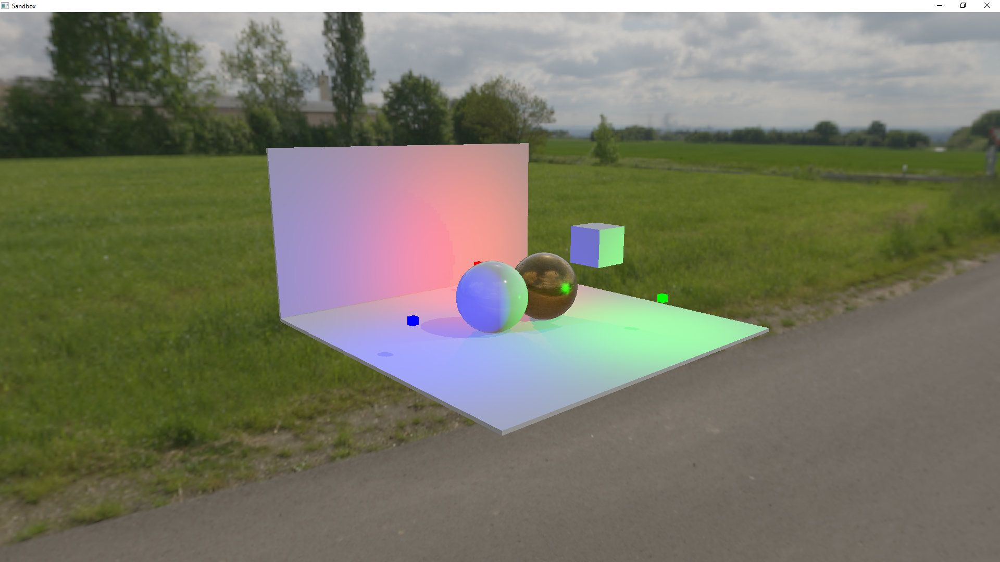

# Nebula

Nebula is a game engine written in C# using OpenGL via Silk.NET.
At the moment it is more of a render engine though, because there is very little game logic code implemented.

## Features

- Entity-Component-System
- Physically based rendering
- Dynamic directional and omnidirectional shadows
- Cascaded shadow maps
- Material system
- Model loading
- Texture loading

